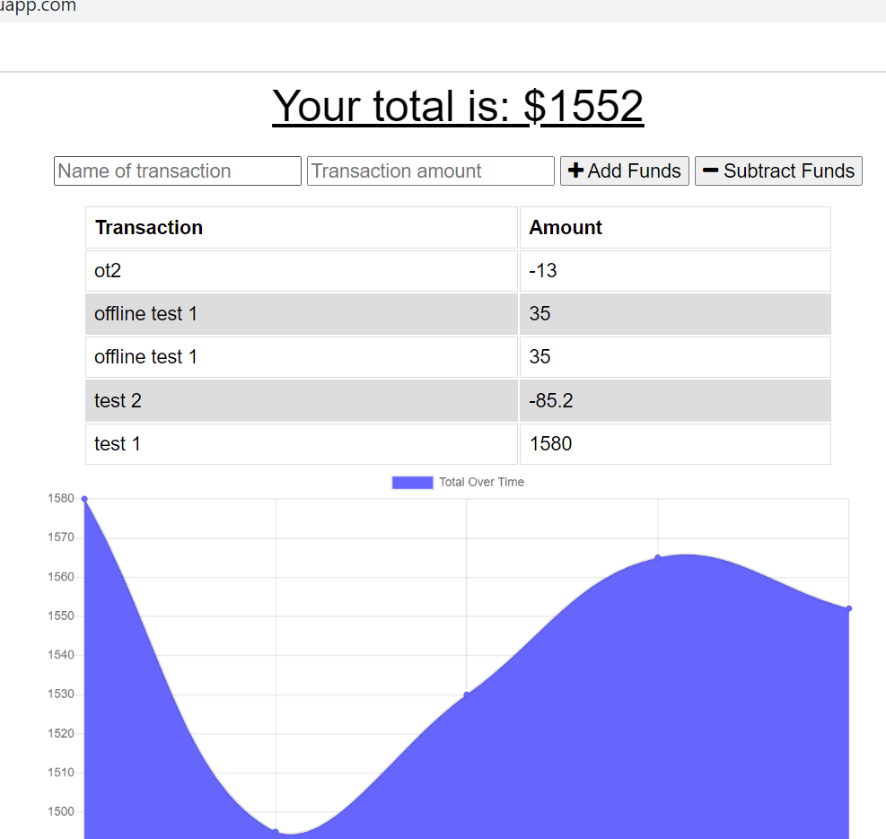

# PWA-Budget-Tracker
budget tracking app using MongoDb with offline capabilities. 

## Application Description
PWA-Budget-Tracker is a single page web application for tracking and charting personal expesnses. If run offline, the user will still be able to make updates to their transaction records; the updates will sync with the database on reconnection. The site is deployed to heroku and data is saved to a MongoDb Atlas database

## Dependencies
to run locally, the app needs the following npm packages installed with "npm intstall"
#### compression
#### express
#### lite-server
#### mongose
#### morgan

## Technologies Used
below is a list of technologies used in the application:
#### JsNode
#### Express
#### MongoDb
#### Mongoose
#### serviceworker
#### IndexDB

## Link to Github Repository
https://github.com/geotecdev/PWA-Budget-Tracker

## Link to deployed application:
https://still-ocean-46560.herokuapp.com/

### Landing Page screenshot
dashboard

License
Copyright (c) 2021 Mike Ruane (geotecdev)

Permission is hereby granted, free of charge, to any person obtaining a copy of this software and associated documentation files (the "Software"), to deal in the Software without restriction, including without limitation the rights to use, copy, modify, merge, publish, distribute, sublicense, and/or sell copies of the Software, and to permit persons to whom the Software is furnished to do so, subject to the following conditions:

The above copyright notice and this permission notice shall be included in all copies or substantial portions of the Software.

THE SOFTWARE IS PROVIDED "AS IS", WITHOUT WARRANTY OF ANY KIND, EXPRESS OR IMPLIED, INCLUDING BUT NOT LIMITED TO THE WARRANTIES OF MERCHANTABILITY, FITNESS FOR A PARTICULAR PURPOSE AND NONINFRINGEMENT. IN NO EVENT SHALL THE AUTHORS OR COPYRIGHT HOLDERS BE LIABLE FOR ANY CLAIM, DAMAGES OR OTHER LIABILITY, WHETHER IN AN ACTION OF CONTRACT, TORT OR OTHERWISE, ARISING FROM, OUT OF OR IN CONNECTION WITH THE SOFTWARE OR THE USE OR OTHER DEALINGS IN THE SOFTWARE.